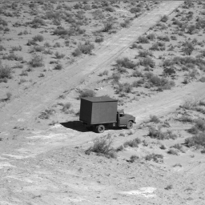

# histogram-modification
Project-4 as part of EE455 - Digital Image Processing 1. This project considers the application of histogram modification to the truck image. The tasks that were to be done are included in the file p4.pdf. This project required us to submit the files in MATLAB by performing Image processing methods without the use of inbuilt MATLAB function for DIP. Please find the report ReportProject4_PavanGurudath.pdf that contains the entire report for this project.

The tasks that were done in this project were- 

a) gamma correction for gamma>1 and gamma<1  
b) contrast stretching  
c) histogram equalization using optimal contrast stretching  
